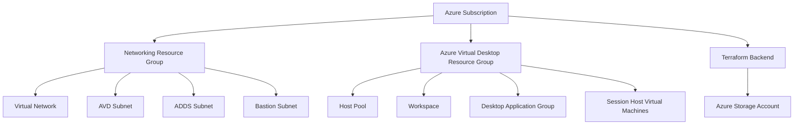

<div align="center">

# ☁️ Dalberg Azure Virtual Desktop Platform

### Enterprise-Scale Azure Virtual Desktop Deployment Framework

Modern Infrastructure Automation powered by Terraform, GitHub Actions & Microsoft Azure

<br>

<p align="center">
  
  
  
  
</p>

<br>


</div>

---

<div align="center">

[Overview](#-platform-overview) •
[Architecture](#-enterprise-architecture) •
[Networking](#-network-architecture) •
[CI/CD](#-cicd-automation) •
[Deployment](#-deployment-steps) •
[Security](#-security-recommendations)

</div>

<br>

<div align="center">

| Environment | IaC | CI/CD | Platform |
|---|---|---|---|
| Development | Terraform | GitHub Actions | Azure Virtual Desktop |

</div>

---

## 📌 Platform Overview

> [!IMPORTANT]
> This repository contains only customer deployment logic.  
> Reusable Terraform modules are maintained separately.

This repository contains the customer-specific deployment configuration for the **Dalberg Azure Virtual Desktop (AVD) Platform**.

The environment is fully automated using:

- ⚡ Terraform Infrastructure as Code (IaC)
- 🔁 Reusable Enterprise Terraform Modules
- 🚀 GitHub Actions CI/CD Pipelines
- ☁️ Azure Remote Backend State Management
- 🔒 Enterprise Network Segmentation

---

## 🎯 Project Objectives

✔ Standardized AVD Deployments  
✔ Multi-Customer Scalable Architecture  
✔ Reusable Infrastructure Modules  
✔ Centralized CI/CD Automation  
✔ Enterprise Naming Standards  
✔ Secure Networking Design  

---

## 🏗 Enterprise Architecture

### High-Level Architecture



## 📂 Repository Structure

```text
customer-dalberg-avd/
│
├── envs/
│   └── dev/
│       ├── main.tf
│       └── variables.tf
│
├── .github/
│   └── workflows/
│       └── terraform.yml
│
└── README.md
```

---

## ⚙️ Deployment Architecture

This repository is responsible for:

- Customer deployment configuration
- Environment-specific variables
- Terraform backend configuration
- CI/CD execution workflows
- Reusable module consumption

---

## 🧩 Reusable Module Strategy

Reusable infrastructure components are maintained separately in:

```text
terraform-azure-modules
```

### Benefits

| Capability | Benefit |
|---|---|
| 🔁 Reusable Modules | Reduced duplication |
| 🏗 Centralized Logic | Easier maintenance |
| 🚀 Multi-Customer Deployments | Faster onboarding |
| ⚡ Standardized CI/CD | Operational consistency |
| ☁️ Platform Engineering Model | Enterprise scalability |

---

## 🌐 Network Architecture

### Virtual Network

Dedicated Azure Virtual Network for Azure Virtual Desktop workloads.

### Example

```text
dalberg-dev-cin-vnet
```

### Address Space

```text
10.0.0.0/16
```

---

## 🛡️ Subnet Segmentation

| Subnet | Purpose |
|---|---|
| `snet-avd` | Azure Virtual Desktop Session Hosts |
| `snet-ad` | Active Directory Domain Services |
| `snet-bastion` | Azure Bastion |
| `GatewaySubnet` | VPN Gateway |

---

## 🔐 Why Dedicated Subnets?

Subnet segmentation provides:

- Better workload isolation
- Easier NSG management
- Improved scalability
- Simplified troubleshooting
- Future FSLogix support
- Future ADDS integration
- Improved security posture

---

## 🖥 Azure Virtual Desktop Components

### 🔷 Host Pool

Distributes user sessions across session hosts.

#### Example

```text
dalberg-dev-cin-avd-hp
```

| Component | Configuration |
|---|---|
| Type | Pooled |
| Load Balancer | DepthFirst |

---

### 🔷 Workspace

Acts as the user access entry point for AVD resources.

#### Example

```text
dalberg-dev-cin-avd-ws
```

---

### 🔷 Desktop Application Group

Publishes desktop access to users.

#### Example

```text
dalberg-dev-cin-avd-dag
```

---

## 💻 Session Hosts

Windows 11 multi-session VMs deployed as AVD Session Hosts.

### Example

```text
dalberg-dev-cin-avd-vm-01
```

---

### VM Configuration

| Component | Configuration |
|---|---|
| Operating System | Windows 11 Enterprise Multi-Session |
| VM Size | Standard_D4s_v5 |
| Disk Type | Standard SSD |
| Session Host Count | Configurable |

---

## 🏷 Naming Standards

### Naming Convention

```text
<client>-<environment>-<region>-<service>-<resource>
```

---

### Examples

| Resource | Example |
|---|---|
| Resource Group | dalberg-dev-cin-rg-avd |
| Virtual Network | dalberg-dev-cin-vnet |
| Host Pool | dalberg-dev-cin-avd-hp |
| Workspace | dalberg-dev-cin-avd-ws |
| Virtual Machine | dalberg-dev-cin-avd-vm-01 |

---

## 🌍 Region Standards

| Code | Azure Region |
|---|---|
| cin | Central India |
| eus | East US |
| wus | West US |

---

## 🗄 Terraform Remote Backend

Terraform state is securely stored in Azure Storage Account.

### Benefits

- Remote state management
- State locking
- Team collaboration
- CI/CD compatibility
- Centralized infrastructure state

---

### Backend Configuration

| Component | Configuration |
|---|---|
| Resource Group | rg-dalberg-terraform-state |
| Storage Account | tfstatedalbergdevstr |
| Container | tfstate |

---

## 🚀 CI/CD Automation

Infrastructure deployment is fully automated using GitHub Actions.

---

### Workflow Location

```text
.github/workflows/terraform.yml
```

---

### Deployment Workflow

```text
Repository Checkout
        ↓
Terraform Installation
        ↓
Azure Authentication
        ↓
Terraform Init
        ↓
Terraform Validate
        ↓
Terraform Plan
        ↓
Terraform Apply
```

---

## 🔑 Required GitHub Secrets

| Secret | Purpose |
|---|---|
| AZURE_CREDENTIALS | Azure Service Principal Authentication |
| TF_VAR_admin_username | Session Host Administrator Username |
| TF_VAR_admin_password | Session Host Administrator Password |

---

## 🔒 Required Azure Permissions

| Role | Scope |
|---|---|
| Contributor | Subscription / Resource Group |
| Storage Blob Data Contributor | Terraform Backend Storage |

---

## 🚀 Deployment Steps

### 1️⃣ Clone Repository

```bash
git clone <repository-url>
cd customer-dalberg-avd
```

---

### 2️⃣ Configure GitHub Secrets

Configure all required repository secrets.

---

### 3️⃣ Push Infrastructure Changes

```bash
git add .
git commit -m "Deploy Dalberg AVD infrastructure"
git push
```

---

### 4️⃣ Monitor GitHub Actions

```text
GitHub
→ Actions
→ Terraform Deploy
```

Verify:

- Terraform Init
- Terraform Plan
- Terraform Apply

---

### 5️⃣ Validate Deployment

```text
Azure Portal
→ Azure Virtual Desktop
→ Host Pools
→ Session Hosts
```

Expected Status:

```text
Available
```

---

## ✨ Current Features

- Reusable Terraform modules
- Enterprise naming conventions
- Dynamic subnet architecture
- Azure Virtual Desktop deployment
- Session host provisioning
- GitHub Actions automation
- Azure remote backend
- Multi-customer deployment model

---

## 🧠 Key Design Decisions

### 🔷 Separate Module Repository

Infrastructure modules are maintained separately to provide:

- Better reusability
- Cleaner architecture
- Centralized management
- Faster onboarding
- Reduced code duplication

---

### 🔷 Dedicated AVD Subnet

Provides:

- Security isolation
- Workload-specific NSGs
- Future FSLogix support
- Better scalability

---

### 🔷 Future ADDS Integration

Architecture supports future integration with:

- Active Directory Domain Services
- DNS Services
- Domain Joining
- FSLogix

---

## 🔮 Planned Enhancements

- Active Directory Domain Services
- FSLogix Profile Containers
- Azure AD Join
- Autoscaling
- Log Analytics
- Azure Monitor Alerts
- Azure Bastion
- Route Tables
- Private Endpoints
- NSG Standardization

---

## 🛠 Common Issues

### VM Name Length Limitation

Windows computer names support a maximum of 15 characters.

#### Resolution

Use separate `computer_name` values for Windows hostnames.

---

### GatewaySubnet Restriction

Azure does not allow NSG association to `GatewaySubnet`.

#### Resolution

Exclude `GatewaySubnet` from NSG association logic.

---

### Terraform State Conflicts

Occurs when resources already exist outside Terraform state.

#### Resolution

- Use remote backend state
- Avoid manual deployments
- Import existing resources if required

---

## 🔐 Security Recommendations

- Never commit credentials to Git
- Store secrets in GitHub Secrets
- Use remote backend state
- Use subnet segmentation
- Apply NSGs
- Follow least privilege access

---

## 🧰 Technologies Used

| Technology | Purpose |
|---|---|
| ☁️ Azure | Cloud Platform |
| 🏗 Terraform | Infrastructure as Code |
| 🚀 GitHub Actions | CI/CD Automation |
| 🖥 Azure Virtual Desktop | Desktop Virtualization |
| 🌐 Azure Networking | Enterprise Networking |
| 🗄 Azure Storage Account | Remote Terraform Backend |

---

## 👨‍💻 Author

### Darshan Thenge

Cloud Engineer specializing in:

- Microsoft Azure
- Amazon Web Services (AWS)
- Terraform
- DevOps
- Azure Virtual Desktop
- Infrastructure Automation

---

<div align="center">

### ⭐ Enterprise Cloud Infrastructure Automation

<br>


</div>
